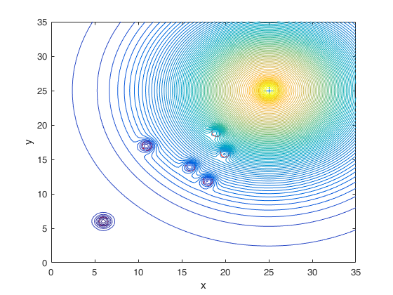
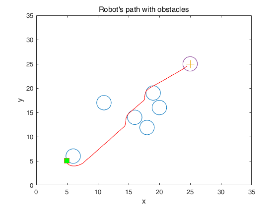
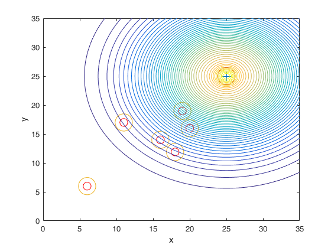

# APF_Code
MATLAB Code of Artificial Potencial Field Method for Robot Path Planning

Authors: Xin Li, Daqi Zhu

Email: lixin850224@163.com; zdq367@aliyun.com

Laboratory of Underwater Vehicles and Intelligent Systems

Shanghai Maritime University

